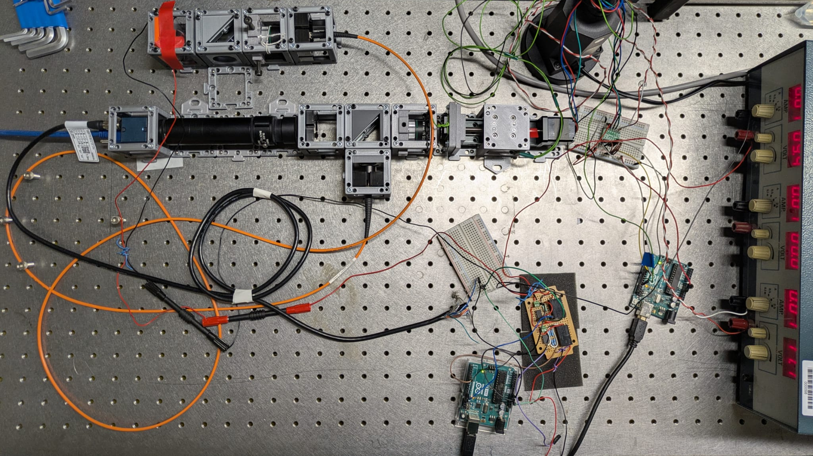

# Fluorescence microscope adapted with UC2 library

[](LICENSE)
[](https://www.gnu.org/licenses/gpl-3.0)
[](https://zenodo.org)

An open-source, modular LED-based fluorescence microscope with infinity optics. This system is capable of acquiring time-lapse videos from living cells inside an incubator and supports X/Y/Z/t acquisitions and fluorescent imaging.

**Intended Audience**: Researchers, engineers, and makers working on laboratory automation, microscopy, robotics, or hardware-software interfacing. This module is designed for users who need robust serial communication between Python and Arduino for instrument control, data acquisition, or interactive hardware systems.




## Documentation

Access the full [documentation website](https://alienor134.github.io/UC2_Fluorescence_microscope/docs)


## Repository Structure

- **Hardware**: CAD files in `INVENTOR/` (source) and `STL/` (3D printing). Specific hardware ca also be found in the submodules, in particular for different motorization options 
- **Software**: Control modules as Git submodules (`ControlCamera`, `ControlLight`, `ControlMotors`, `ControlSerial`)
- **Documentation**: Build guides, automation, and bills of materials in `docs/`

## Quick Start

```bash
# Clone the repository with submodules
git clone https://github.com/Alienor134/UC2_Fluorescence_microscope.git
cd UC2_Fluorescence_microscope
git submodule update --init --recursive
```

The instrument can run without specific software except the camera. The LED control and motor control are optional and can be replaced by manual actions. Still, for detailed setup instructions of the software, see [docs/automate.md](docs/automate.md)

## License and Attribution

### Hardware License
The hardware designs (CAD files, STL files, and mechanical assemblies) are licensed under the **CERN Open Hardware Licence Version 2 - Strongly Reciprocal (CERN-OHL-S-2.0)**. See [LICENSE](LICENSE) for full text.

### Software License
The control software modules are licensed under the **GNU General Public License v3.0 (GPL-3.0)** or later. See individual LICENSE files in each submodule directory.

### Documentation License
Documentation is licensed under **Creative Commons Attribution-ShareAlike 4.0 International (CC BY-SA 4.0)**.

## Citation

If you use this microscope design in your research, please cite it properly. We have registered this project on Zenodo for permanent archival with a persistent DOI.


### Archived Versions

** Zenodo Archive**: [DOI to be added after deposit]

This repository's releases are permanently archived on Zenodo, providing stable DOIs for citation. Each major release receives a separate DOI. Always cite the specific version you used in your work.

## Acknowledgments

This project builds upon several open-source initiatives:

### Hardware Acknowledgments
- **[OpenUC2](https://github.com/openUC2/UC2-GIT)**: Base modular cube system and optical components.

### Software Acknowledgments
- **[pymmcore-plus](https://pymmcore-plus.github.io/pymmcore-plus/)** to facilitate working with Micro-manager backend in pure Python/C environments.
- **[ROMI project](https://github.com/romi)** (Sony CSL) providing open-source tools to control hardware with Arduino and Python.
- **[Sacred](https://github.com/IDSIA/sacred)** to organise automated experimental runs. 


## OSHWA Compliance

This project follows the [Open Source Hardware Association (OSHWA) definition](https://www.oshwa.org/definition/) of open-source hardware. All design files, documentation, and bills of materials are freely available. Modifications and derivatives are encouraged under the terms of the CERN-OHL-S-2.0 license.

For complete OSHWA compliance details, see [CONTRIBUTING.md](CONTRIBUTING.md).

## Version Information

- **Current Version**: 1.0.0
- **Last Updated**: January 2026
- **Git Repository**: https://github.com/Alienor134/UC2_Fluorescence_microscope
- **Zenodo DOI**: [To be added after deposit]


*This project is open-source and released under CERN-OHL-S-2.0 (hardware) and GPL-3.0 (software) licenses.*