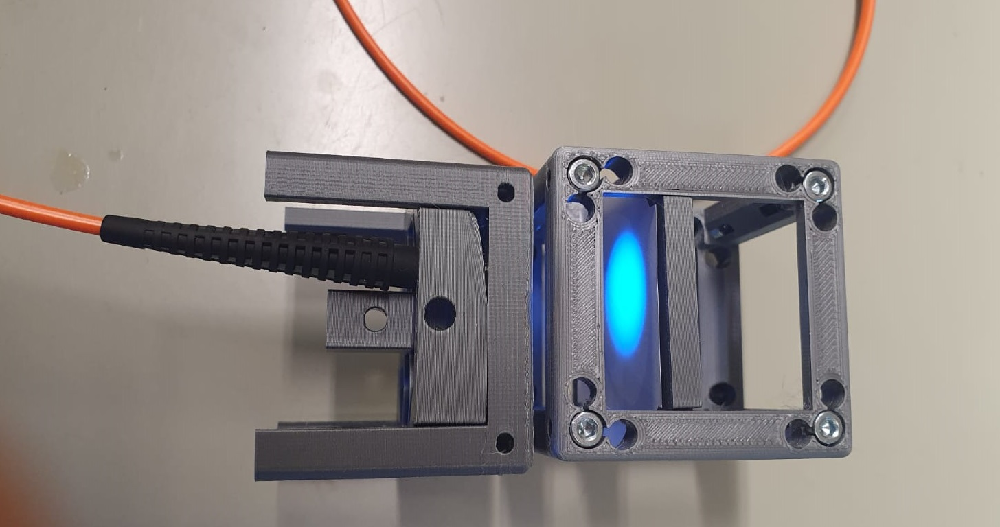

# Objective 1: Inject 2 LEDs combined with a dichroic filter into an optical fiber 

## Bill of materials

### Hardware :gear:

| Component|      Quantity      |  Price per unit | Example|  
|----------|:-------------:|------:|------:|  
| High power LED blue 470nm |  1 | 2€ | [Mouser](https://www.mouser.fr/ProductDetail/997-LXZ1PB01)|  
| High power LED purple 405nm|    1   |   6€ | [Mouser](https://www.mouser.fr/ProductDetail/997-LHUV0405A065)|  
| PCB star Luxeon Z|    2   |   1€ | [LED mounting bases](https://led-mounting-bases.com/fr/mcpcb-pour-led/340-star-mcpcb-for-1-led-lumileds-luxeon-z-es.html)|
| Band-pass filter 475 |1 | 27€ | [475 GB 25](https://www.comaroptics.com/components/filters/glass-colour-filters)|  
| Band pass filter 490| 1| 27€ |[390 GB 25](https://www.comaroptics.com/components/filters/glass-colour-filters)|  
| High pass filter 480| 1| 45€ |[480 IY 125](https://www.comaroptics.com/components/filters/dichroic-filters/long-pass-dichroic-filters)| 
| Asphreic condenser lens focal 16mm | 2 |    18€ | [Thorlabs](https://www.thorlabs.de/thorproduct.cfm?partnumber=ACL25416U) |  
| Optical Fiber 400µm 0.5 NA | 1 |    81€ | [Thorlabs](https://www.thorlabs.com/thorproduct.cfm?partnumber=M45L02) |  
| Microscope objective | 1 | --€ | [--](--)|  
| SMA fiber adaptater | 2 |29€ | [Thorlabs](https://www.thorlabs.com/thorproduct.cfm?partnumber=SM1SMA#ad-image-0)|
| RECOM RCD 24/1.2| 2 |28€ | [Mouser](https://www.mouser.fr/ProductDetail/RECOM-Power/RCD-24-120-W?qs=XF8hdbuHJAW68Zb6thLHmw%3D%3D&mgh=1&vip=1&gclid=Cj0KCQjw_4-SBhCgARIsAAlegrXhc2OQlAVF3fglcc28Iyp3B-155_z7d_U6xnrkKlrQZ5bdMsEOsxkaAsEtEALw_wcB])|
| potentiometer | 2 |--€ | [--](--)|

### UC2 parts

Link             |  Image of the part
:-------------------------:|:-------------------------:
[Base Plate puzzle](https://github.com/openUC2/UC2-GIT/tree/master/CAD/ASSEMBLY_Baseplate)  |  
[CUBE Base](https://github.com/openUC2/UC2-GIT/tree/master/CAD/ASSEMBLY_CUBE_Base)  |  
[LED Star](https://github.com/openUC2/UC2-GIT/tree/master/CAD/ASSEMBLY_CUBE_LED) | 
[Lens (cylindrical)](https://github.com/openUC2/UC2-GIT/tree/master/CAD/ASSEMBLY_CUBE_Lens_CYLINDRICAL) | 
[Dichroic Beam splitter](https://github.com/openUC2/UC2-GIT/tree/master/CAD//ASSEMBLY_CUBE_Dichroic_Beamsplitter) | 
[objective holder](https://github.com/openUC2/UC2_OpenFiberCoupler#logo) | 

### Assembly

1. Solder LEDs to star PCB. This first step is the hardest of the tutorial. First tin-coat the electrodes of the LED. Make sure the electrodes are not gated by the tin. Let the PCB star warm to 200&deg;C on a heating plate. Then connect the LED to the PCB star, apply pressure. Take the mounted LED from the plate and let it cool down. Solder the electric wires to PCB.

2. Build the LED controller circuit. You will need the RECOM DC/DC converter, a potentiometer and electric wires. (TODO: EM filtering with capacitor and inductor). Use a regulated power supply to power the RECOM and another for the potentiometer (TODO: connect Arduino instead).

3. Mount the blue and purple LEDs on the UC2 star holder according to [UC2 documentation](https://github.com/openUC2/UC2-GIT/tree/master/CAD/ASSEMBLY_CUBE_LED). Add the lens mounted on the holder in front of the LED, and the filter mounted on the filter holder. 

4. Make sure that you can observe the image of the chip on a white surface

Notes: the 3 mounts don't hold still once the base cube it closed. We had to use double-sided tape to fix the LED mount. -> we will increase the size of the mount slightly to tight it with the screws when closing the cube. 
the clamp to hold the filter works fine but is not sufficient to hold the lens which has a different geometry. We will slightly increase the diameter of the hole to be able to maintain the lens with a Thorlabs 1 inch clamp that we will screw. 

5. Mount the dichroic filter on the dichroic filter holder accroding to [UC2 documentation](https://github.com/openUC2/UC2-GIT/tree/master/CAD/ASSEMBLY_CUBE_Dichroic_Beamsplitter)

6. Combine the two LEDs with the dichroic filter according to this scheme: 

 
 With [LED 1](https://www.mouser.fr/ProductDetail/997-LHUV0405A065), [LED 2](https://www.mouser.fr/ProductDetail/997-LXZ1PB01), [F1](https://www.comaroptics.com/components/filters/glass-colour-filters), [F2](https://www.comaroptics.com/components/filters/glass-colour-filters), [D1](https://www.comaroptics.com/components/filters/dichroic-filters/long-pass-dichroic-filters), [lens](https://www.thorlabs.de/thorproduct.cfm?partnumber=ACL25416U).

 The 2 LEDs are combined, however the size of the light beam is on the centimeter scale, but the optical fiber's aperture is 400µm. We use a microscope objective to reach the spot size required to inject in the fiber. (for now: 40x/0.65)

 7. Prepare the 3D parts for the fiber injection: XY fine displacement [objective holder](https://github.com/openUC2/UC2_OpenFiberCoupler/blob/main/STL/Application_OpenFiberCoupling_20_Cube_Inser_Flexuremanipulator_v3.stl) and lens holder to hold the [SMA fiber adapter](https://www.thorlabs.com/thorproduct.cfm?partnumber=SM1SMA#ad-image-0). You can find more info on [UC2 documentation for fiber coupler](https://github.com/openUC2/UC2_OpenFiberCoupler). Mount the objective in one cube and the fiber holder in another and assemble them.

 

 

Note: The XY objective holder is great ! The only issue is that the rest position is centered and the screws only allow positive X or Y displacement. We attached an elastic so that the rest position is tight to the corner (minimal X and Y position). That way it is possible to explore the whole X-Y displacement space allowed by the 3D piece with only 2 screws.

 

8. Adjust the focal distances so that the spot from the LEDs matches the entrance of the microscope objective and the output of the objective matches the aperture of the fiber. (TODO: give more details here)

9. Check the output of the fiber and the homogeneity of the spot. The blue light is brighter so you can play with the potentiometers to see the 2 colors separately. 

 

